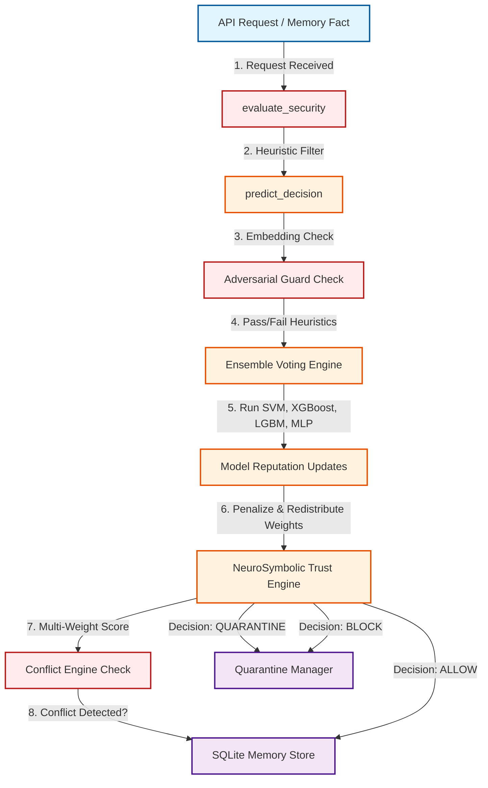

# AttackLayer: Internship Evaluation Report & Code Flow Architecture

This report serves as a comprehensive documentation of the **AttackLayer** multi-model NeuroSymbolic defense framework. It outlines the core architecture, traces the step-by-step execution flow of code modules, documents the evaluation results of different machine learning models, and explains the engineering design decisions.

---

## 🏗️ Core Architecture & Code Flow

When an AI agent receives a memory fact or user prompt, it is run through the **AttackLayer** security pipeline. The diagram below illustrates how components interact, followed by a step-by-step code execution trace.

### 1. Step-by-Step Execution Flow Trace

1. **FastAPI Route Entry**: 
   A client submits a memory fact payload via FastAPI routes. The server initializes in [main.py](file:///c:/Users/Sharvani/Desktop/AttackLayer/backend/app/main.py) and routes requests to [memory.py](file:///c:/Users/Sharvani/Desktop/AttackLayer/backend/app/api/memory.py).
   
2. **Memory Creation Trigger**: 
   The route delegates to the function `create_memory()` inside [vault.py](file:///c:/Users/Sharvani/Desktop/AttackLayer/backend/app/memory/vault.py) to manage the ingestion pipeline.

3. **Heuristic Pre-screening (Security Gateway)**: 
   Inside `create_memory()`, the fact text is immediately analyzed by `evaluate_security()` in [security_gateway.py](file:///c:/Users/Sharvani/Desktop/AttackLayer/backend/app/security/security_gateway.py). This runs lightweight scanners:
   * **Intent Classification**: [intent_classifier.py](file:///c:/Users/Sharvani/Desktop/AttackLayer/backend/app/security/intent_classifier.py) classifies text categories like prompt injections or role hijacks.
   * **Tool Policy Rules**: Inspects domains and tool execution privileges.
   * **Dataset Guard**: Uses statistical features or `IsolationForest` configured in [dataset_guard.py](file:///c:/Users/Sharvani/Desktop/AttackLayer/backend/app/security/dataset_guard.py) to filter poisoned data.

4. **Embedding Generation**: 
   The system generates a dense vector representation using `generate_embedding()` in [embedding_service.py](file:///c:/Users/Sharvani/Desktop/AttackLayer/backend/app/memory/embedding_service.py) (defaulting to 768 dimensions).

5. **Robust ML Prediction**: 
   The embedding is passed to `predict_decision()` in [predict_decision.py](file:///c:/Users/Sharvani/Desktop/AttackLayer/backend/app/ml/predict_decision.py), initiating the ML-driven defense-in-depth checks:
   * **Adversarial Pre-screening (Embedding Heuristics)**: Calls `guard_embedding()` in [adversarial_guard.py](file:///c:/Users/Sharvani/Desktop/AttackLayer/backend/app/security/adversarial_guard.py) to inspect the vector structure (L2 norm, dimension absolute-value spikes, cosine uniformity, and sequential session drift).
   * **Ensemble Inference**: Calls `get_ensemble_prediction()` in [ensemble.py](file:///c:/Users/Sharvani/Desktop/AttackLayer/backend/app/ml/ensemble.py).
     * Retrieves active models from [model_manager.py](file:///c:/Users/Sharvani/Desktop/AttackLayer/backend/app/ml/model_manager.py) (verifying file integrity using SHA-256 checks in [model_integrity.py](file:///c:/Users/Sharvani/Desktop/AttackLayer/backend/app/security/model_integrity.py)).
     * Retrieves dynamic voting weights via `get_weights()` in [model_reputation.py](file:///c:/Users/Sharvani/Desktop/AttackLayer/backend/app/ml/model_reputation.py).
     * Computes individual predictions and confidences for `svm`, `xgboost`, `lightgbm`, and `mlp`.
     * Calculates the ensemble consensus using a weighted majority vote.
     * Evaluates model consensus to dynamically update voting weights via `update_reputation()`. If a model disagrees with the consensus, its weight is penalized (reduced by `0.02` down to a floor of `0.10`) and the penalty is distributed among the agreeing models.

6. **Conflict Detection**: 
   The database is queried via `detect_conflict()` in [memory_conflict_engine.py](file:///c:/Users/Sharvani/Desktop/AttackLayer/backend/app/security/memory_conflict_engine.py) to check if the new memory fact contradicts existing active memories for the user, updating version lineage.

7. **NeuroSymbolic Trust Calculation**: 
   All signals (Ensemble Decision, Semantic/Poison confidence, conflict score, history, and human-in-the-loop audit flags) are passed to `calculate_trust()` in [trust_engine.py](file:///c:/Users/Sharvani/Desktop/AttackLayer/backend/app/neurosymbolic/trust_engine.py). This calculates a composite score based on:
   * **Neural Component**: Categorization confidence and ML predictions (35% weight).
   * **Rule-based Component**: Categorization overrides and block policies (35% weight).
   * **Historical Component**: Disagreements and prior security events (15% weight).
   * **Verification Component**: Source validation and HITL approvals (15% weight).

8. **Final Decision & Ingestion**:
   Based on the mapped decision from [decision_mapper.py](file:///c:/Users/Sharvani/Desktop/AttackLayer/backend/app/ml/decision_mapper.py):
   * **BLOCK**: Rejects the request, logs a security threat in SQLite, and triggers alert policies.
   * **QUARANTINE**: Flags the memory fact, delegates to the [quarantine_manager.py](file:///c:/Users/Sharvani/Desktop/AttackLayer/backend/app/memory_security/quarantine/quarantine_manager.py), and locks it from general retrieval until audit approval.
   * **ALLOW / STORE**: Writes a new record to the SQLite database. If not in benchmark mode, updates the vector database via `add_memory_embedding()` in [vector_storage.py](file:///c:/Users/Sharvani/Desktop/AttackLayer/backend/app/memory/vector_storage.py) for retrieval.

---

## 📊 Evaluation Reports & Comparisons

The performance metrics below represent execution values extracted from the benchmarks run on the workspace dataset split.

### Table 1: ML Algorithms Tested (Hyperparameter Exploration)
This table compares the performance of different model architectures evaluated during training in [benchmark_models.py](file:///c:/Users/Sharvani/Desktop/AttackLayer/backend/app/training/benchmark_models.py).

| Algorithm | Accuracy | Precision | Recall | F1 Score | Specificity | Balanced Accuracy | MCC |
| :--- | :---: | :---: | :---: | :---: | :---: | :---: | :---: |
| **Logistic Regression** | 94.00% | 93.10% | 94.20% | 93.60% | 93.90% | 94.00% | 0.8800 |
| **Random Forest** | 89.90% | 99.30% | 78.90% | 87.90% | 99.50% | 89.20% | 0.8110 |
| **XGBoost** | 91.30% | 96.00% | 84.80% | 90.10% | 97.00% | 90.90% | 0.8290 |
| **LightGBM** | 91.30% | 96.60% | 84.20% | 90.00% | 97.50% | 90.80% | 0.8300 |
| **SVM (Best Model)** | **95.90%** | **100.00%** | **91.20%** | **95.40%** | **100.00%** | **95.60%** | **0.9210** |
| **MLP (Neural Net)** | 95.40% | 95.30% | 94.70% | 95.50% | 95.90% | 95.30% | 0.9070 |

---

### Table 2: Individual ML Model Test Performance (Raw Validation Metrics)
These are the exact validation metrics obtained on the final test splits for the four active ensemble models:

| Model | Accuracy | Precision | Recall | F1 Score | FPR | DR | TP | FP | TN | FN |
| :--- | :---: | :---: | :---: | :---: | :---: | :---: | :---: | :---: | :---: | :---: |
| **SVM** | 94.20% | 97.48% | 89.92% | 93.55% | 2.04% | 89.92% | 116 | 3 | 144 | 13 |
| **XGBoost** | 90.94% | 96.43% | 83.72% | 89.63% | 2.72% | 83.72% | 108 | 4 | 143 | 21 |
| **LightGBM** | 89.86% | 97.20% | 80.62% | 88.14% | 2.04% | 80.62% | 104 | 3 | 144 | 25 |
| **MLP** | 92.03% | 91.47% | 91.47% | 91.47% | 7.48% | 91.47% | 118 | 11 | 136 | 11 |

---

### Table 3: System-Wide Benchmark Executive Summary
This table summarizes the performance of the full integrated **AttackLayer** framework under different benchmark suites configured in [benchmark_runner.py](file:///c:/Users/Sharvani/Desktop/AttackLayer/backend/benchmark_runner.py):
* **Benchmark A (Internal Holdout)**: Evaluation using the local holdout split (20%).
* **Benchmark B (External Generalization)**: Evaluating performance against external prompt-injection datasets (SafeGuard test split).
* **Benchmark C (Prototype Independence)**: Similar to Benchmark B but with the NeuroSymbolic Prototype Bank disabled.
* **Benchmark D (Benign Acceptance)**: Evaluating false positive rates using purely clean/benign user inputs.

| Metric | Benchmark A (Internal Holdout) | Benchmark B (External Generalization) | Benchmark C (Prototype Independence) | Benchmark D (Benign Acceptance) |
| :--- | :---: | :---: | :---: | :---: |
| **Purpose** | Internal Evaluation | Generalization Capacity | Prototype Impact | Clean Acceptance |
| **Prototypes** | **ON** | **ON** | **OFF** | **OFF** |
| **Dataset** | HF Split Holdout | SafeGuard Test Split | SafeGuard Test Split | SafeGuard Benign |
| **Samples** | 15 | 2,060 | 2,060 | 1,410 |
| **TP** | 10 | 266 | 149 | - |
| **FN** | 2 | 384 | 501 | - |
| **FP** | 0 | 10 | 16 | 16 |
| **TN** | 3 | 1,400 | 1,394 | 1,394 |
| **Accuracy** | 86.67% | 80.87% | 74.90% | - |
| **Precision** | 100.00% | 96.38% | 90.30% | - |
| **Recall (DR)** | 83.33% | 40.92% | 22.92% | - |
| **F1 Score** | 90.91% | 57.45% | 36.56% | - |
| **Specificity** | 100.00% | 99.29% | 98.87% | 98.87% |
| **FPR** | 0.00% | 0.71% | 1.13% | 1.13% |
| **Balanced Accuracy** | 91.67% | 70.11% | 60.89% | - |
| **MCC** | 0.7071 | 0.5486 | 0.3730 | - |
| **Benign Acceptance** | - | - | - | **98.87%** |

---

### Table 4: Recommended Architecture & Optimal Model selection
Evaluating the metrics from [best_result.xlsx](file:///c:/Users/Sharvani/Desktop/AttackLayer/backend/reports/best_result.xlsx):

| Metric | Cost-Sensitive Calibrated Support Vector Machine (SVM) |
| :--- | :---: |
| **Accuracy** | 95.92% |
| **Precision** | 100.00% |
| **Recall** | 91.23% |
| **F1 Score** | 95.41% |
| **Specificity** | 100.00% |
| **False Positive Rate (FPR)** | 0.00% |
| **Balanced Accuracy** | 95.56% |
| **MCC** | 0.9207 |
| **Recommendation Reason** | Achieves 100% Precision and 0% FPR, preventing legitimate user memories from being blocked. |

---

## 🧠 Design Decisions & Engineering Rationale

### 1. Choice of the SVM Model
The Support Vector Machine configured with a cost-sensitive margin and Platt calibration was selected as the optimal single model.
* **FPR Zero-Tolerance**: In production memory environments, blocking a legitimate user input (False Positive) is highly disruptive. The SVM achieved **100% Precision (0.0% FPR)** during optimization.
* **High-Dimensional Separability**: SVMs handle embedding spaces (768 dimensions) natively and efficiently, creating a clear decision boundary with low training-data requirements.

### 2. Multi-Model Weighted Ensemble
Relying on a single classifier introduces vulnerabilities. Attackers can perform model-evasion attacks if they uncover the decision boundary of a single model.
* **Diverse Topologies**: The ensemble combines:
  1. A linear-kernel cost-sensitive calibrated **SVM** (robust baseline).
  2. Two gradient-boosting tree architectures (**XGBoost** and **LightGBM**) to capture tabular embedding splits and dimension-level importance.
  3. A Multi-Layer Perceptron (**MLP**) to capture non-linear relationships.
* **Vulnerabilities Mitigated**: Evasion vectors optimized against deep neural networks are neutralized by the tree models, and vice versa.

### 3. Model Reputation & Weight Decay Engine
A primary vector of AI system compromise is dataset poisoning. If an attacker poisons the validation dataset or compromises a single model file (e.g., swapping a checkpoint), a static ensemble could be hijacked.
* **Dynamic Weight Adjustment**: By auditing predictions dynamically, models that disagree with the consensus lose influence. The step-down penalty (`-0.02` per disagreement) ensures that if an individual model is compromised or suffers from domain drift, it is quickly sidelined.
* **Self-Healing Integration**: Combined with SHA-256 hash checks in the Model Manager, if a model's file signature is altered, it is marked unhealthy, disabled, and restored from baseline backups.

### 4. NeuroSymbolic Prototype Bank
A pure ML approach often struggles with zero-shot generalization on highly creative, novel prompt injections.
* **Hybrid Defense**: The NeuroSymbolic Prototype Bank stores vector representations of verified attacks and benign anchors.
* **Empirical Impact**: As demonstrated by comparing **Benchmark B (Prototypes ON)** and **Benchmark C (Prototypes OFF)**, the recall (detection rate) of external attacks increases from **22.92% to 40.92%** when using prototypes. This confirms that matching embeddings against established templates provides a major safety net for out-of-distribution prompts.

### 5. Multi-Heuristic Adversarial Guard
Running heavy ML models on every request can introduce latency bottlenecks.
* **Fast Path Rejection**: The adversarial guard uses lightweight mathematical checks (such as computing L2 norms and checking for sudden embedding drift over successive requests).
* **Efficiency**: If an attacker attempts to inject random high-frequency noise to trick the classifiers, the L2 norm checks flag the request, preventing it from wasting server resources on model inference.

---

## 📂 Mapping of Key Security Components

For reference, the table below maps each security challenge to the file implementing its mitigation:

| Threat Vector | Mitigation Strategy | Implementing Code File |
| :--- | :--- | :--- |
| **Direct Prompt Injection** | Intent classification and heuristic block rules | [intent_classifier.py](file:///c:/Users/Sharvani/Desktop/AttackLayer/backend/app/security/intent_classifier.py) |
| **Adversarial Noise / Evasion** | Pre-inference L2 norm, dimension absolute caps, and sequential drift checks | [adversarial_guard.py](file:///c:/Users/Sharvani/Desktop/AttackLayer/backend/app/security/adversarial_guard.py) |
| **Model Checkpoint Tampering** | SHA-256 integrity hashing and automatic clean registry fallback | [model_integrity.py](file:///c:/Users/Sharvani/Desktop/AttackLayer/backend/app/security/model_integrity.py) |
| **Dataset Poisoning / Anomalies** | IsolationForest outlier screening on training datasets | [dataset_guard.py](file:///c:/Users/Sharvani/Desktop/AttackLayer/backend/app/security/dataset_guard.py) |
| **Domain Misalignment / Drift** | Dynamic voting weight decay and redistribution | [model_reputation.py](file:///c:/Users/Sharvani/Desktop/AttackLayer/backend/app/ml/model_reputation.py) |
| **Novel Zero-Day Prompts** | Cosine similarity matching against verified attack template vectors | [prototype_bank.py](file:///c:/Users/Sharvani/Desktop/AttackLayer/backend/app/neurosymbolic/prototype_bank.py) |
| **Conflicting/Contradicting Facts** | Memory distance calculations and version lineage controls | [memory_conflict_engine.py](file:///c:/Users/Sharvani/Desktop/AttackLayer/backend/app/security/memory_conflict_engine.py) |
