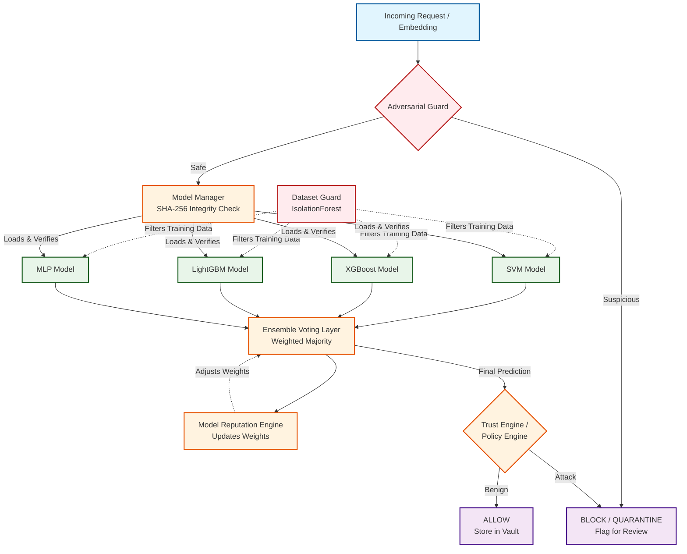

# AttackLayer: Multi-Model NeuroSymbolic Defense Framework

AttackLayer is a robust, resilient, multi-model defense framework designed to protect AI memory systems and applications from adversarial manipulation, dataset poisoning, and prompt injection attacks.

Unlike single-model detectors, AttackLayer employs a **defense-in-depth** architecture, ensuring reliability even if individual models are compromised, datasets are poisoned, or attackers use unknown evasion techniques.

---

## 🌟 Key Features

*   **Ensemble Voting Layer**: Combines predictions from SVM, XGBoost, LightGBM, and an MLP. Uses dynamic weighted majority voting to determine if an input is an attack.
*   **Model Reputation & Dynamic Weights**: Continuously monitors the performance of each model. If a model consistently disagrees with the consensus, its voting weight is dynamically reduced.
*   **Dataset Poisoning Defense**: Utilizes an `IsolationForest` statistical guard to filter out anomalous and poisoned training samples *before* they reach the model training pipeline.
*   **Self-Healing Model Manager & Integrity Verification**: Generates and verifies SHA-256 hashes of all trained models. If tampering is detected, the system automatically falls back to clean registry backups.
*   **Multi-Heuristic Adversarial Guard**: Detects adversarial perturbations in embeddings via L2 norm checks, dimension spike checks, drift detection, and an optional neural network detector.
*   **SHAP Explainability**: Provides feature importance and prediction explainability for tree-based models (XGBoost, LightGBM) to aid in human-in-the-loop (HITL) review.

---

## 🏗️ Architecture & Data Flow

When a new embedding (memory fact or prompt) enters the system, it traverses a multi-layered security gauntlet.



### End-to-End Execution Flow

1.  **Input Reception**: A user query or a new memory fact is converted into an embedding vector.
2.  **Adversarial Pre-screening (`adversarial_guard.py`)**: The embedding is immediately checked for adversarial noise (abnormal norms, dimension spikes, or sudden drift). If flagged, it bypasses the ML models entirely and is quarantined.
3.  **Model Loading & Integrity (`model_manager.py` & `model_integrity.py`)**: The application requests the models. The Model Manager checks the SHA-256 hashes of `svm.pkl`, `xgboost.pkl`, `lightgbm.pkl`, and `mlp.pth`. If any model is corrupted, it is automatically restored from a clean backup registry.
4.  **Ensemble Prediction (`ensemble.py`)**: The clean embedding is passed to all healthy active models. Each model returns a prediction (Benign/Attack) and a confidence score.
5.  **Weighted Voting & Reputation (`model_reputation.py`)**: The ensemble aggregates the votes using dynamic weights.
    *   Models that agree with the majority maintain or increase their reputation.
    *   Models that dissent have their weight penalized, preventing a single compromised model from hijacking the system.
6.  **Trust Engine Integration**: The ensemble's final prediction, overall confidence, and agreement rate are passed to the Trust Engine.
7.  **Final Decision**: Based on the Trust Engine's policy rules, the input is either ALLOWED (stored in the memory vault) or BLOCKED/QUARANTINED (rejected or flagged for HITL review).

---

## 🚀 Setup & Execution Instructions

### 1. Prerequisites
Ensure you have Python 3.10+ installed.

```bash
# Clone the repository
git clone <your-repo-url>
cd AttackLayer/backend

# Create and activate a virtual environment
python -m venv .venv
# Windows:
.venv\Scripts\activate
# Linux/Mac:
source .venv/bin/activate

# Install dependencies
pip install -r requirements.txt
```

### 2. Initializing the Defense Framework

Before running the API, you must generate the baseline models and their integrity hashes.

```bash
# 1. Train the models and generate evaluation benchmarks
python -m app.training.benchmark_models

# 2. Generate SHA-256 integrity hashes for the freshly trained models
python -m app.security.model_integrity
```

*Note: The `benchmark_models.py` script automatically trains the Dataset Guard, the ML models, generates SHAP plots, and outputs evaluation metrics to the `reports/` and `figures/` directories.*

### 3. Running the Application

Start the FastAPI backend server:

```bash
uvicorn app.main:app --reload --host 0.0.0.0 --port 8000
```

The system is now running and actively protecting endpoints using the ensemble defense.

### 4. Running Benchmarks & Unit Tests

To evaluate the system's performance against prompt injection and evasion datasets:

```bash
python benchmark_runner.py --workers 10
```

To run the comprehensive suite of unit tests for the security modules:

```bash
# Install pytest if not already installed
pip install pytest

# Run the test suite
python -m pytest tests/ -v
```

---

## 📊 Reports & Visualizations

After running `benchmark_models.py`, check the `reports/` and `figures/` folders for detailed metrics:
*   `reports/metrics_table.csv`: Raw precision, recall, F1, and FPR scores.
*   `figures/radar_chart.png`: A multi-axis comparison of model strengths.
*   `figures/roc_curves.png`: AUC-ROC performance.
*   `figures/shap_summary_xgboost.png`: Explainability plots showing which embedding dimensions drive the attack classifications.
